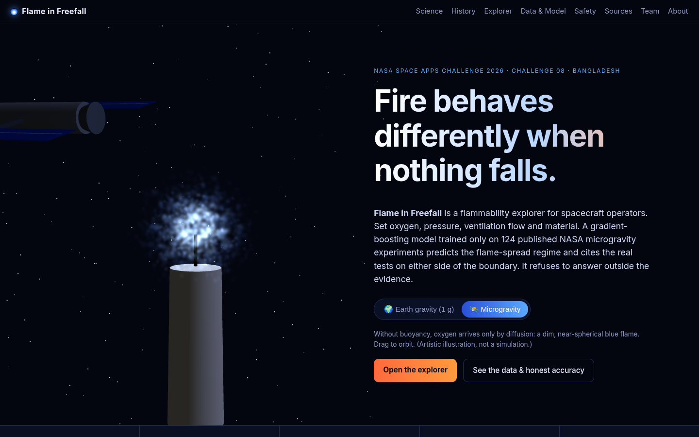

# Flame in Freefall 🔥🛰️
**NASA Space Apps Challenge 2026, Challenge 08: "Flame in Freefall: AI-Powered Fire Safety Insights from Microgravity Combustion Data"**
Team: `[Team name]` · Local event: Bangladesh · License: Apache-2.0

> **Problem.** Fire on a spacecraft behaves nothing like fire on Earth. Without buoyancy, flames can survive at oxygen levels and in gentle ventilation flows where they would behave differently on the ground. The data that tells us *where* a material stops burning is scattered across decades of NASA technical reports.
> **Our solution.** Flame in Freefall is a flammability explorer that runs locally. You set oxygen %, pressure, ventilation flow and material. A gradient-boosting classifier trained **only on 124 published NASA microgravity experiments** predicts the flame-spread regime (`spread` / `marginal_spread` / `no_spread`), shows its uncertainty, **refuses to answer outside the tested envelope**, and cites the real experiments on either side of the boundary.
> **Users.** Spacecraft fire-safety engineers, mission planners choosing cabin atmospheres (for example, exploration atmospheres at reduced pressure and elevated O₂), and students.



## Contents
- [Run it locally](#run-it-locally-windows)
- [What's in the site](#whats-in-the-site)
- [Data sources](#data-sources-every-row-is-traceable)
- [Model card](#model-card-honest-metrics)
- [API](#api)
- [Limitations](#limitations)
- [Repository layout](#repository-layout)
- [AI use disclosure](docs/AI_USE.md)
- [Past-winner research](docs/research-past-winners.md)

---

## Run it locally (Windows)
Requirements: **Python 3.11** and **Node.js 18+** (tested with Python 3.11.9 and Node 24). Everything runs on your PC; no cloud service or API key is needed.

```bat
setup.bat      :: one time: .venv, pip install, train + test the model, npm install, build the site
start.bat      :: serves the site and API on http://localhost:8000 and opens your browser
```
Stop the server with **Ctrl+C** in the start.bat window, by closing that window, or by running `stop.bat` (it stops whatever is listening on port 8000).

Developer mode (hot reload): run `dev.bat`. The backend runs on :8000 with `--reload` and the Vite dev server runs on http://localhost:5173, proxying `/api` to :8000.

Manual equivalent (any OS):
```bash
python -m venv .venv && .venv/bin/pip install -r backend/requirements.txt     # Windows: .venv\Scripts\...
cd backend && ../.venv/bin/python -m src.compute.model && ../.venv/bin/python -m tests.test_core
cd ../frontend && npm install && npm run build
cd ../backend && ../.venv/bin/python -m uvicorn app.main:app --port 8000
```

Reproduce the data (optional, requires internet access):
```bash
cd backend
python scripts/fetch_ntrs_corpus.py   # re-harvests NTRS titles/abstracts via the public NTRS API -> data/corpus/ntrs_corpus.json
python scripts/build_dataset.py       # rebuilds data/experiments.csv/.parquet from the hand-transcribed, cited rows
python -m src.compute.model           # retrain + cross-validate -> data/artifacts/model.joblib, model_card.json
```

## What's in the site
| Section | What it shows |
|---|---|
| **Hero (3D)** | An interactive three.js scene (react-three-fiber). Toggle between **Earth gravity** (a buoyant yellow teardrop flame) and **microgravity** (a dim, near-spherical blue flame). Drag to orbit. The low-poly station is procedural. This is an artistic illustration, not a simulation. |
| **The problem / science** | Why fire differs in microgravity: no buoyant convection, diffusion-limited oxygen supply, and quenching at low flow. Each claim cites an NTRS record. |
| **History timeline** | SSCE (Shuttle), drop-tower tests, BASS/BASS-II (ISS MSG), Saffire I–VI (Cygnus), plus FLEX/ACME/SoFIE context. All entries are cited. |
| **Flammability explorer (MVP)** | Sliders for O₂ %, pressure kPa and flow cm/s, with the training envelope shaded; a material and flow-direction selector; a prediction card with class probabilities and uncertainty; a *range guard* refusal; a deterministic explanation; a 2D decision-boundary plot with the real experiments overlaid; the 3 nearest real experiments with clickable NTRS citations and quotes; and related reports from TF-IDF retrieval. |
| **Killer demo** | Press **"Play the 21% → 17% O₂ demo"**. For SIBAL fabric at 1 atm and 3 cm/s concurrent flow, the prediction flips from `spread` to `no_spread` at about 17.5% O₂. The explanation names the real BASS-II tests on each side (NTRS 20150008962: sustained spread at 17.6% O₂ and quench at 17.2% O₂, both at 3 cm/s). |
| **Data & model transparency** | The model card, CV accuracy vs the majority baseline, leave-reports-out accuracy, the confusion matrix, class definitions, the per-material training envelope, and a searchable table of all 124 rows with the source quote for each. The dataset is downloadable as a CSV. |
| **For spacecraft operators** | Safety framing: how to read the output, why refusals matter, and that the tool is for decision support only and is not a certification tool (NASA-STD-6001 testing still governs). |
| **Sources / Team / About** | The full reference list. The team section uses **placeholders** (`[Team member name]`) for the team to fill in. About the challenge, plus the AI-use disclosure. |

## Data sources (every row is traceable)
`backend/data/experiments.csv` (also `.parquet`) has **124 rows**. Each row carries `report_id`, `source_url`, `source_title`, `source_location` (table or page), a verbatim `quote` of the condition and outcome, and `notes` on any interpretation. Rows were transcribed by hand from the report tables/text in `backend/scripts/build_dataset.py`. **No values are synthetic or interpolated.**

| Rows | NTRS record | Source | What was extracted |
|---:|---|---|---|
| 46 | [19880006471](https://ntrs.nasa.gov/citations/19880006471) | Olson (1987), *The Effect of Microgravity on Flame Spread over a Thin Fuel*, NASA TM-100195 | Drop-tower, quiescent Kimwipes (single and double thickness), 1 atm, 14–100% O₂ (Tables A-I/A-III) |
| 33 | [20150008962](https://ntrs.nasa.gov/citations/20150008962) | Zhao, T'ien, Ferkul, Olson (2015), BASS/BASS-II concurrent flame spread over SIBAL fabric | ISS MSG, 1 atm, 16.4–21% O₂, 2.2–53 cm/s. Sustained spread vs quench/blow-off/no ignition (appendix table) |
| 13 | [19890014267](https://ntrs.nasa.gov/citations/19890014267) | Olson, Ferkul, T'ien (1989), opposed-flow extinction over a thin fuel, NASA TM-101479 | Drop-tower, opposed flow 0–6.75 cm/s, extinction limits (Table I) |
| 9 | [20210011521](https://ntrs.nasa.gov/citations/20210011521) | Urban et al. (2021), Saffire IV and V, ICES-2021-266 | Large-scale Cygnus tests: SIBAL, cotton, PMMA (Tables 1–2) |
| 7 | [20170008805](https://ntrs.nasa.gov/citations/20170008805) | Urban et al. (2017), Saffire-I/II | SIBAL, silicone, Nomex, PMMA (Table I) |
| 6 | [20080034883](https://ntrs.nasa.gov/citations/20080034883) | Olson et al. (2008), exploration atmospheres, NASA/TM-2008-215260 | 0-g flammability limits for Nomex, Ultem and Mylar at 70.3 kPa and 30 cm/s (Table 1) |
| 3 | [20240002981](https://ntrs.nasa.gov/citations/20240002981) | Urban et al. (2024), Saffire VI preliminary results | SIBAL in exploration atmospheres |
| 3 | [20050177200](https://ntrs.nasa.gov/citations/20050177200) | NASA Lewis (1996), SSCE eight flights | Filter paper, 50% O₂, 1/1.5/2 atm |
| 3 | [19970020608](https://ntrs.nasa.gov/citations/19970020608) | Altenkirch et al. (1997), SSCE thick-fuel results | Thick PMMA (decelerating spread) |
| 1 | [19950007798](https://ntrs.nasa.gov/citations/19950007798) | SSCE aboard USML-1 (1994) | Filter paper, 35% O₂ / 1 atm |

Supporting citations used to confirm conditions (listed in `extra_sources`): [20210017785](https://ntrs.nasa.gov/citations/20210017785), [20260001992](https://ntrs.nasa.gov/citations/20260001992), [19960008387](https://ntrs.nasa.gov/citations/19960008387), [19990053971](https://ntrs.nasa.gov/citations/19990053971).

**Retrieval corpus:** `backend/data/corpus/ntrs_corpus.json` holds 217 NTRS records (title, abstract, authors, date, URL), harvested from the public [NTRS API](https://ntrs.nasa.gov/api/citations/search) with 22 combustion queries (FLEX, BASS, Saffire, SoFIE, ACME, BRE, flammability limits, …).

**Class definitions** (mapping each report's own wording):
- `spread`: sustained flame propagation.
- `marginal_spread`: oscillatory spread, "unmeasurably small" spread, spread decelerating toward extinction, or an anchored/stabilised flame that does not propagate.
- `no_spread`: no ignition, extinction/quench, blow-off, or an "insignificant burn".

Unit conversions: psia → kPa (×6.895), atm → kPa (×101.325). Where a report gives an O₂ range, the midpoint is used and noted in `notes`.

**Not used for rows** (the source did not state every needed value in text or tables, e.g. pressure missing, or values only in figures): RITSI/spot-ignition (NTRS 20000070853), SKOROST, BASS-II PMMA rod data (figures only), and a BASS Nomex/Ultem summary slide. No NASA OSDR records are used as rows (all rows come from NTRS reports).

## Model card (honest metrics)
| | |
|---|---|
| Task | 3-class classification of the flame-spread regime |
| Model | `sklearn.ensemble.GradientBoostingClassifier(n_estimators=150, max_depth=2, learning_rate=0.1, random_state=42)` inside a Pipeline with one-hot encoding |
| Features | `oxygen_pct`, `pressure_kpa`, `flow_cm_s`, `material` (one-hot), `flow_direction` (quiescent/opposed/concurrent) |
| Training data | n = **124** from 10 NTRS reports. Class counts: spread 82 · no_spread 23 · marginal_spread 19 |
| **Stratified 5-fold CV accuracy** | **0.790** (out-of-fold) |
| Balanced accuracy (5-fold) | 0.718 |
| Repeated stratified CV (5×10) | 0.80 ± 0.06 |
| Leave-reports-out (GroupKFold by report) | 0.718: a harder test, where whole reports are held out |
| Majority-class baseline | 0.661 |
| Per-class F1 | spread 0.86 · marginal 0.82 · **no_spread 0.48** |

Confusion matrix (out-of-fold; rows = true, columns = predicted):

| | no_spread | marginal | spread |
|---|---:|---:|---:|
| **no_spread** | 10 | 2 | 11 |
| **marginal_spread** | 1 | 16 | 2 |
| **spread** | 8 | 2 | 72 |

**Range guard.** The per-material min/max of O₂, pressure and flow (plus the tested flow directions) are stored in `model_card.json`. `/predict` returns `prediction: null`, `in_training_range: false` and the list of `range_violations` for any input outside that material's envelope, or for an unknown material. It still returns the nearest real experiments, so the user can see what *was* tested.

**Uncertainty.** Each prediction reports the class probabilities, a confidence level (high/medium/low, from the top-class probability, the distance to the nearest real experiment and how many of the 3 nearest agree) and a *contrast experiment*: the nearest real test of the same material with a different outcome.

**Explanation layer.** It is a deterministic template (`backend/src/compute/explain.py`) that phrases only the fields of the prediction object and the retrieved citations. An optional local LLM (Ollama) path exists but is **off by default**. Enable it with `FLAME_LLM=ollama` and `FLAME_LLM_MODEL=<model>`. Any LLM output containing a number that is not in the prediction facts is rejected, and the app falls back to the template.

## API
Every route is served both with and without the `/api` prefix.
- `GET /health`: status plus model summary.
- `GET /model`: the full model card (metrics, confusion matrix, envelope).
- `GET /experiments[?material=]`: the training rows with citations. `GET /api/experiments.csv` downloads the CSV.
- `POST /predict` with body `{"oxygen_pct":21,"pressure_kpa":101.3,"flow_cm_s":3,"material":"SIBAL_fabric","flow_direction":"concurrent"}` returns `prediction`, `probabilities`, `model{type,n_train,cv_accuracy,features,…}`, `in_training_range`, `range_violations`, `nearest_experiments[3]{report_id,source_url,quote,…}`, `contrast_experiment`, `uncertainty`, `explanation`, `related_reports`.
- `GET /boundary?material=&flow_direction=&x=oxygen_pct&y=flow_cm_s`: a prediction grid for the decision-boundary plot.
- `GET /corpus`: the retrieval corpus metadata.

## Limitations
- **Small data.** 124 rows from 10 reports. Three material groups (thin cellulose, SIBAL fabric, double cellulose) supply 79% of the rows. Nomex, Ultem, Mylar, cotton and silicone have only 1–4 rows each, so their predictions are close to lookups of those rows and their envelopes are tiny.
- **Class imbalance.** `no_spread` recall is only 0.43. The model tends to over-predict `spread`, which is the *less* conservative error for safety. Treat any `spread` probability above about 20% as a warning.
- **Envelope is a box.** The range guard checks per-feature min/max, so a point can sit inside the box but still be far from any real test (for example, a combination of high flow and low O₂ that was never tested). The nearest-experiment distance and the uncertainty level flag this, but do not refuse on it.
- **Heterogeneous facilities.** Drop-tower tests (about 5 s of microgravity) are mixed with long-duration ISS and Cygnus tests, and sample sizes and geometries differ. Short drop-tower tests may label as "spread" a flame that would later self-extinguish.
- **Label mapping.** Mapping each report's wording onto 3 classes involves judgement. It is documented per row in `notes`.
- **Not a certification tool.** Material acceptance for flight is governed by NASA-STD-6001 testing. This tool is for exploration and decision support only.

## Repository layout
```
backend/
  app/main.py              FastAPI app (API + serves frontend/dist)
  src/compute/model.py     train, cross-validate, save artifact + envelope
  src/compute/predict.py   range guard, prediction, nearest/contrast experiments, uncertainty
  src/compute/retrieval.py TF-IDF retrieval over the NTRS corpus
  src/compute/explain.py   deterministic explanation (+ optional, guarded local LLM)
  scripts/                 fetch_ntrs_corpus.py, build_dataset.py (all rows with quotes)
  data/                    experiments.csv/.parquet, corpus/, artifacts/model.joblib + model_card.json
  tests/test_core.py       range refusal, metadata, 21->17% demo crossing
frontend/                  Vite + React + TypeScript + three.js (@react-three/fiber, drei)
docs/                      research-past-winners.md, AI_USE.md, screenshots/
setup.bat start.bat stop.bat dev.bat
```

## Roadmap
Extract more NTRS tables (FLARE, SoFIE results as they are published, NASA-STD-6001 Test 1 upward-limit data), add ACME gas-flame limits as a separate model, replace the box envelope with a convex-hull or density-based guard, and add calibrated probabilities.

## Credits and license
Data: NASA Technical Reports Server (public NASA works). Libraries: FastAPI, scikit-learn, pandas, React, Vite, three.js, @react-three/fiber, @react-three/drei (all open source).
NASA does not endorse this project. Code is © `[Team name]` 2026, licensed under the **Apache License 2.0** (see `LICENSE`).
