# IGNITE-AI 🔥🛰️
**Predictive Fire Safety Analytics for Space Station Orbit & Rocket Transit**

Challenge: *Flame in Freefall: AI-Powered Fire Safety Insights from Microgravity Combustion Data* · License: **Apache-2.0**

> **Problem.** Fire behaves differently without gravity: flames become rounded, can be nearly invisible, and some materials burn at lower oxygen in low gravity than in the Earth screening test. The evidence is spread across decades of NASA reports and data archives.
> **Solution.** IGNITE-AI runs locally. You pick an environment (Earth 1 g, Moon 0.165 g, Mars 0.38 g, ISS ~0 g, or a rocket-transit cabin) and set oxygen, pressure, ventilation fan speed, material and gas mix. A 3D flame reacts live. A classifier trained **only on 143 published NASA experiments** predicts `spread` / `marginal_spread` / `no_spread`, **refuses to predict outside the tested envelope** (including untested gravity levels and gas mixes), and shows the real experiments behind each answer. An offline assistant, **Ask IGNITE-AI**, answers questions from a NASA combustion knowledge base with verbatim, linked quotes.

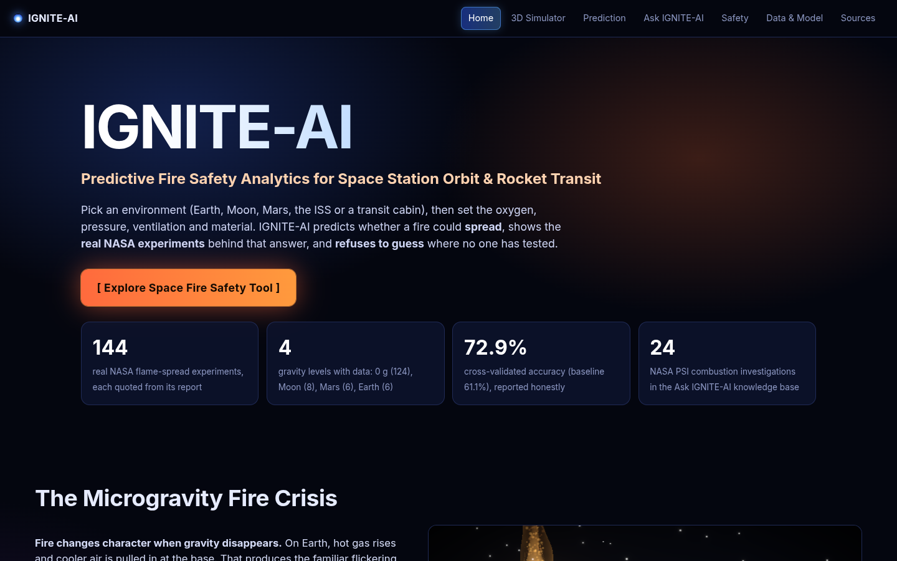

| 3D Simulator · ISS µg | Earth 1 g | Moon 0.165 g | Mars 0.38 g |
|---|---|---|---|
| 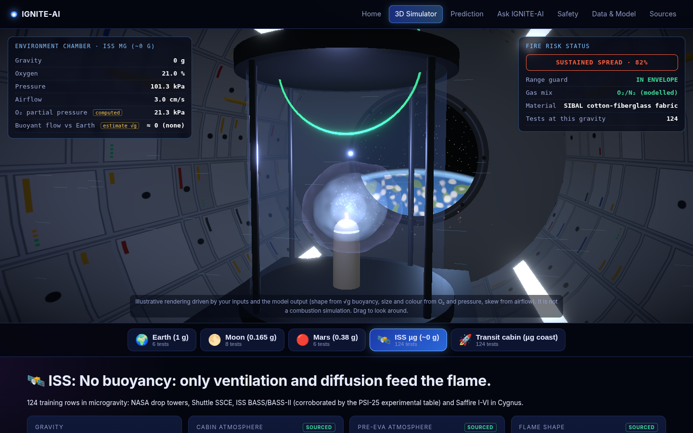 | 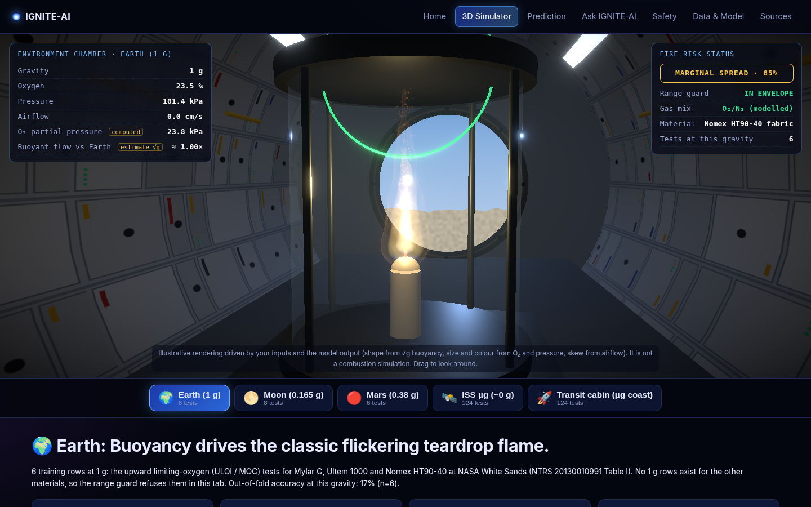 | 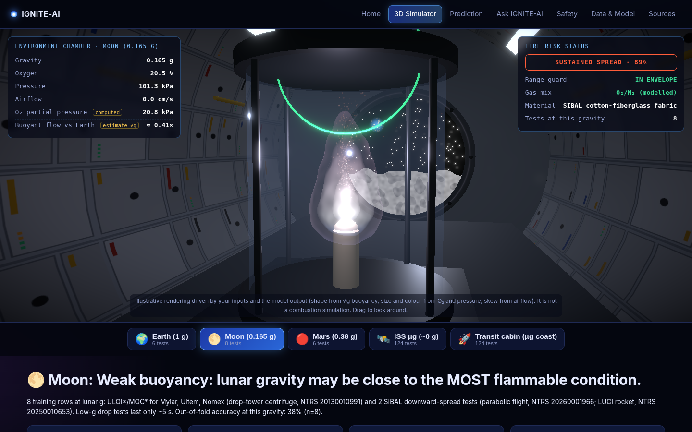 | 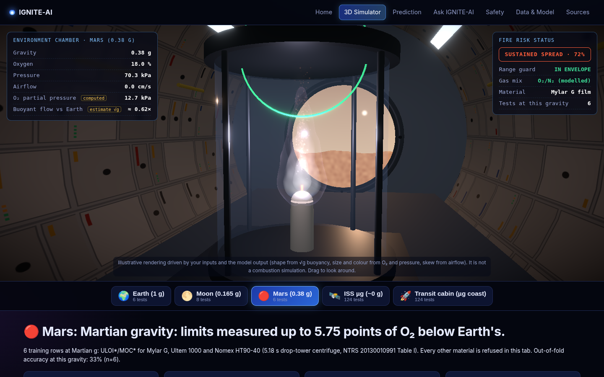 |

| Prediction | Ask IGNITE-AI | Safety | Data & Model | Sources | Mobile nav |
|---|---|---|---|---|---|
| 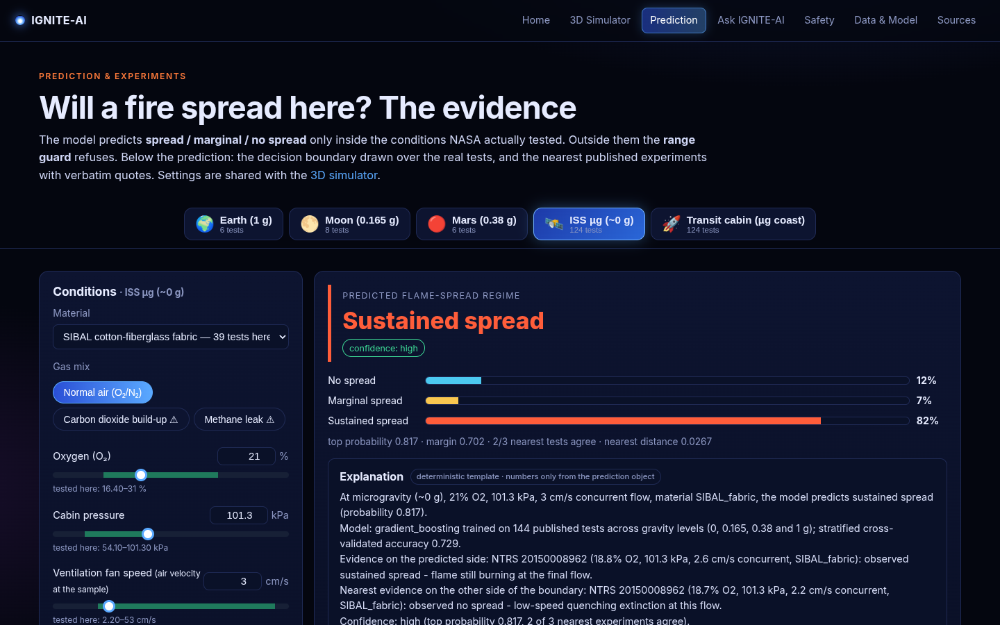 | 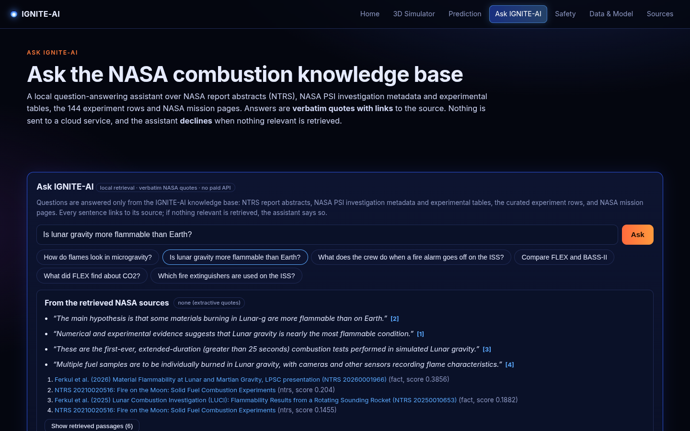 | 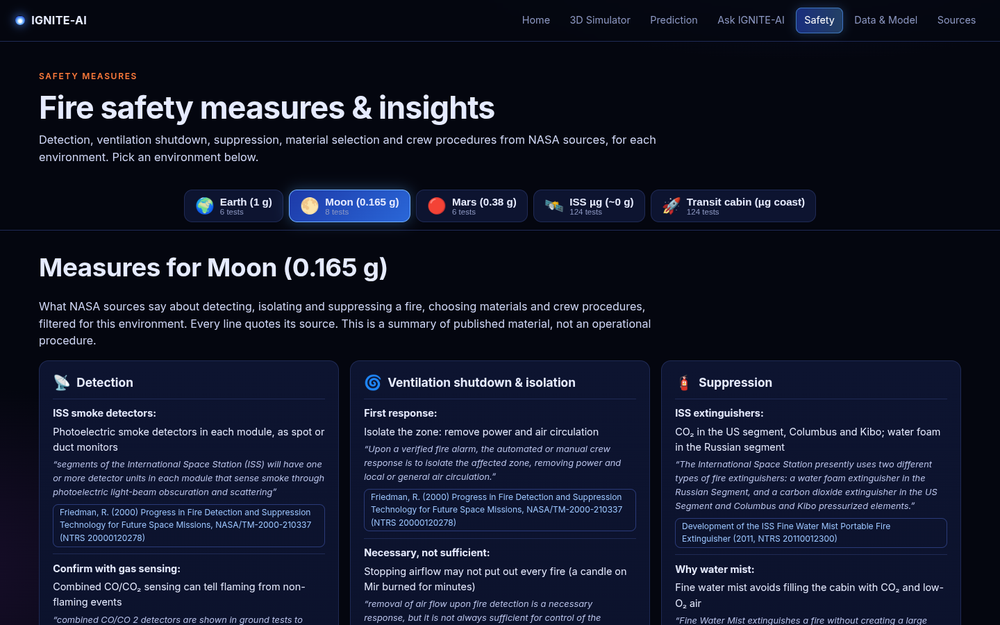 | 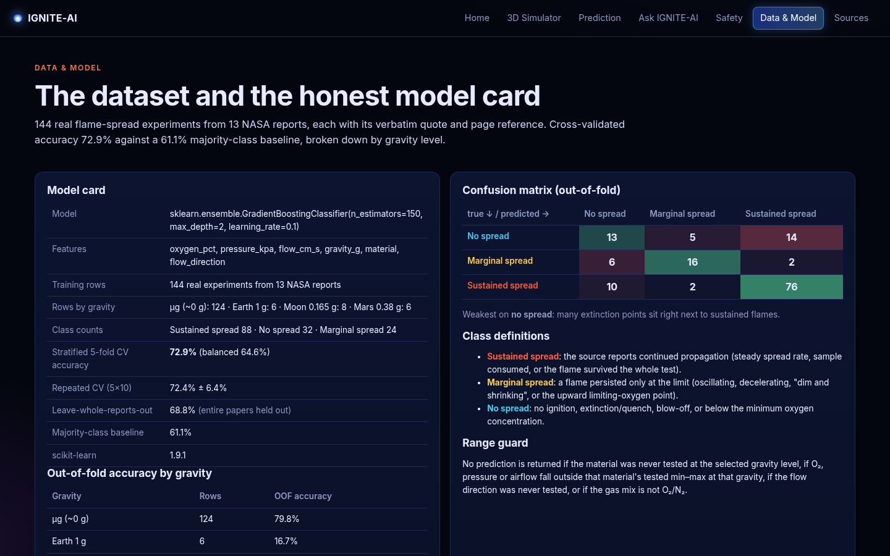 | 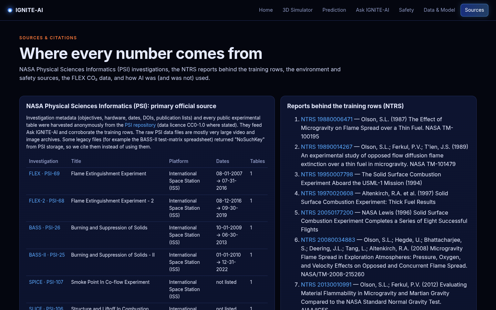 | 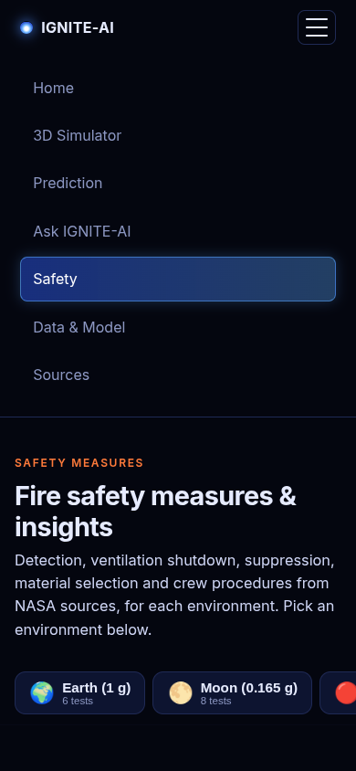 |

## Contents
[Run it](#run-it-locally-windows) · [Site structure](#site-structure) · [Data sources](#data-sources) · [Moon & Mars](#moon--mars-how-partial-gravity-is-handled) · [Ask IGNITE-AI (RAG)](#ask-ignite-ai-local-rag) · [Model card](#model-card-honest-metrics) · [Deploy](#deploy-netlify-frontend--hugging-face-space-backend) · [Crawlable content](#crawlable-content-for-search-engines-and-ai-tools) · [API](#api) · [Limitations](#limitations) · [Layout](#repository-layout) · [AI use](docs/AI_USE.md)

## Run it locally (Windows)
Requirements: **Python 3.11** and **Node.js 18+**. No cloud service, no API key.
```bat
setup.bat      :: one time: .venv, pip install, train + test the model, npm install, build the site
start.bat      :: serves the site + API on http://localhost:8000 (landing) and http://localhost:8000/simulator (tool)
stop.bat       :: stops whatever is listening on port 8000
dev.bat        :: hot-reload dev mode (backend :8000, Vite :5173)
```
Manual (any OS): `python -m venv .venv`, `pip install -r backend/requirements.txt`, then in `backend/` run `python -m src.compute.model` and `python -m tests.test_core`, in `frontend/` run `npm install` and `npm run build`, and finally in `backend/` run `python -m uvicorn app.main:app --port 8000`.

Refresh the data (optional, needs internet):
```bash
cd backend
python scripts/fetch_psi.py           # NASA PSI metadata + public experimental tables -> data/psi/
python scripts/fetch_ntrs_corpus.py   # NTRS titles/abstracts -> data/corpus/ntrs_corpus.json (285 records)
python scripts/fetch_nasa_pages.py    # 3 NASA web pages (combustion research, ACME, SoFIE) -> data/corpus/nasa_pages.json
python scripts/build_dataset.py       # rebuilds data/experiments.csv from the hand-transcribed, cited rows
python -m src.compute.model           # retrain + cross-validate
```

## Site structure
Every sector is its own page. A persistent top nav bar (a hamburger menu on phones) links them all and highlights the current page. Every page path is a real server route, so deep links and refreshes work, and each one comes with its own server-rendered text (see [Crawlable content](#crawlable-content-for-search-engines-and-ai-tools)). The environment, sliders and prediction are shared state, so they carry over between the Simulator, Prediction and Safety pages. `?env=earth|moon|mars|iss|transit` selects the environment in a link.

| Page | URL | What's on it |
|---|---|---|
| Home | `/` | Title and tagline, the **[ Explore Space Fire Safety Tool ]** button (goes to `/simulator`), key-number cards, **The Microgravity Fire Crisis** (cited, with a live 1 g vs ~0 g flame comparison), why it matters, how it works, and cards for every page |
| 3D Flame Simulator | `/simulator` | See below |
| Prediction & Experiments | `/predict` | Environment tabs and the same controls; the prediction, probabilities, range guard and O₂-slide demo; the decision-boundary plot over the real tests; the nearest real experiments with quotes; the FLEX CO₂ panel when the CO₂ gas chip is picked |
| Ask IGNITE-AI | `/ask` | The local question-answering assistant (verbatim, cited quotes; declines when nothing relevant is found) and how it works |
| Safety Measures | `/safety` | Environment tabs, then detection, ventilation shutdown and isolation, suppression, material selection, crew procedures, and Moon/Mars or transit specifics. Every item quotes a NASA source |
| Data & Model | `/data` | The model card, per-gravity accuracy, confusion matrix, envelope by material × gravity, and the full searchable dataset |
| Sources & Citations | `/sources` | The PSI investigation table, the NTRS reports behind the rows, the environment and safety sources, the FLEX CO₂ summary, the AI-use disclosure and an About section |

The old `/demo` link redirects to `/simulator`. Unknown paths return a 404 page.

**3D Flame Simulator (`/simulator`)**, from top to bottom:
1. **3D viewport.** A procedural flame (layered shader shells with a blue base, a sooty yellow body and a halo, plus embers, smoke and airflow streaks, with bloom) sits in a combustion chamber inside a procedural module or habitat. The window view changes with the environment. The flame reacts to the inputs:
   - **gravity:** teardrop → sphere, using √g buoyancy;
   - **O₂ and pressure:** size, brightness and soot colour;
   - **fan speed:** skew and elongation;
   - **model output:** `marginal` pulses weakly, `no_spread` goes out and leaves smoke, and a refusal shows a grey "unknown" flame.

   HUD readouts show gravity, O₂, pressure, airflow, O₂ partial pressure (*computed*), buoyant flow vs Earth (*estimate √g*), fire-risk status, range guard and gas-mix status. It is an illustration, not a combustion simulation.
2. **Environment tabs:** Earth (1 g), Moon (0.165 g), Mars (0.38 g), ISS µg (~0 g) and **Transit cabin (µg coast)**. Coasting between planets is free fall, so the transit tab uses the microgravity data, with Saffire (fires inside Cygnus spacecraft) as the closest analogue. Powered-flight thrust phases are not modelled, and the tab says so.
3. **Environment data and conditions.**
   - Sourced fact cards for the tab (gravity, cabin or habitat atmosphere, relevant experiments), each with a verbatim quote and link. Estimates carry an **ESTIMATE** badge.
   - Sliders for O₂, pressure and ventilation fan speed, with the tested band shaded in green.
   - Material and flow-direction selectors, and gas-mix chips (Normal air / Methane leak / Carbon dioxide build-up).
   - The live prediction panel, with links on to the evidence (`/predict`) and to the safety measures (`/safety`).

## Data sources
### Training rows: `backend/data/experiments.csv`, **143 rows from 13 NASA reports**
Each row has `gravity_g`, `report_id`, `source_url`, `source_location` (table or page), a verbatim `quote`, and `notes`/`extra_sources`. Rows are transcribed in `backend/scripts/build_dataset.py`. **None are synthetic or interpolated.**

| Rows | Gravity | Source |
|---:|---|---|
| 45 | 0 g | [NTRS 19880006471](https://ntrs.nasa.gov/citations/19880006471) Olson 1987, quiescent thin cellulose (drop tower) |
| 33 | 0 g | [NTRS 20150008962](https://ntrs.nasa.gov/citations/20150008962) BASS/BASS-II SIBAL concurrent spread (ISS MSG) |
| 13 | 0 g | [NTRS 19890014267](https://ntrs.nasa.gov/citations/19890014267) Ferkul 1989 (NASA CR-182185), opposed-flow extinction |
| 9 / 7 / 3 | 0 g | Saffire IV–V [20210011521](https://ntrs.nasa.gov/citations/20210011521), Saffire I–II [20170008805](https://ntrs.nasa.gov/citations/20170008805), Saffire VI [20240002981](https://ntrs.nasa.gov/citations/20240002981) (Cygnus) |
| 6 | 0 g | [NTRS 20080034883](https://ntrs.nasa.gov/citations/20080034883) Olson et al. 2008, exploration atmospheres |
| 3 / 3 / 1 | 0 g | SSCE: [20050177200](https://ntrs.nasa.gov/citations/20050177200), [19970020608](https://ntrs.nasa.gov/citations/19970020608), [19950007798](https://ntrs.nasa.gov/citations/19950007798) |
| **18 (new)** | **1 g, 0.38 g, 0.165 g** | [NTRS 20130010991](https://ntrs.nasa.gov/citations/20130010991) Olson & Ferkul 2012, Table I p.6: upward limiting oxygen (ULOI) and minimum oxygen (MOC) for Mylar G, Ultem 1000 and Nomex HT90-40 at 1 g (NASA White Sands), Martian and Lunar g (drop-tower centrifuge) |
| **1 (new)** | 0.165 g | [NTRS 20260001966](https://ntrs.nasa.gov/citations/20260001966) Ferkul et al. 2026: SIBAL, lunar g, 21% O₂, 1 atm, "Steady, downward spread ... entire 20-sec test" |
| **1 (new)** | 0.165 g | [NTRS 20250010653](https://ntrs.nasa.gov/citations/20250010653) LUCI (spinning New Shepard rocket): SIBAL downward spread in lunar g, air at normal pressure, steady spread 0.92 mm/s |

Rows by gravity: 0 g 123 · Moon 8 · Mars 6 · Earth 1 g 6. Classes: spread 87 · no_spread 32 · marginal 24.

**Dataset audit (a teammate's review, checked against the NTRS PDFs):**
- **E046 retired.** In Olson 1987 Table A-III (p.27), the 100% O₂ level lists 4.59 and 2.72 cm/s with no average. The 2.72 cm/s row (V 2.72, L 4.78, W 2.11) exactly repeats the last 40% O₂ entry of Table A-I (p.26), which is part of that table's printed 40% average (2.73). Every other repeated level in Table A-III has an average, and 2.72 is below both 80% values (3.44, 3.55). This is a copy error in the report itself, so the row was removed. Row IDs are kept stable: E046 is simply absent.
- **Saffire I-1, II-5 and II-6 oxygen.** The ICES-2021 paper (NTRS 20210011521, Table 2) prints these as 21% (rounded). The Saffire I/II results paper (NTRS 20170008805, Table I, p.28) gives 21.7 to 21.5% for I-1 (used: 21.6) and ~22.1% for II-5 and II-6. PSI-98/99 agree. The rows now use the precise values and cite both papers.

### NASA Physical Sciences Informatics (PSI), the primary official data source
`scripts/fetch_psi.py` reads PSI's public JSON endpoints anonymously, the same ones the PSI web app uses. It saves metadata for **24 investigations** (objective, approach, hypothesis, hardware, dates, DOI, licence, publication list, file inventory) to `data/psi/psi_investigations.json`, and every public **experimental table** to `data/psi/tables/`. Investigations are CC0-1.0 where PSI states a licence.
- Covered: FLEX [PSI-69](https://psi.nasa.gov/physci/repo/data/investigations/PSI-69), FLEX-2 PSI-68, BASS-II [PSI-25](https://psi.nasa.gov/physci/repo/data/investigations/PSI-25), BASS PSI-26, SPICE [PSI-107](https://psi.nasa.gov/physci/repo/data/investigations/PSI-107), SLICE PSI-106, CFI PSI-39, ACME BRE PSI-20, ACME Flame Design PSI-10, CLD PSI-21, E-FIELD PSI-22, s-Flame PSI-23, CFI-G PSI-159, SAME PSI-102, SAME-R PSI-101, DAFT/DAFT-2 PSI-47, SAFFIRE-I/II/III PSI-98/99/100, and modelling or guest investigations PSI-60, 62, 115, 117 and 142.
- **How PSI data are used:**
  - **Corroboration.** 40 training rows now carry PSI links in `extra_sources`/`notes`: 29 BASS-II tests whose O₂ matches the PSI-25 table exactly, and the Saffire I/II/III rows. Discrepancies are noted in the row notes, not "fixed". For example, PSI-99 lists Saffire 2-1 O₂ ≈ 21.5% where the NTRS paper gives ≈ 22.1%, and PSI lists some Saffire flows as 20 cm/s where NTRS gives 25.
  - **FLEX (PSI-69)** has 274 droplet tests (methanol and heptane; pressure, O₂/N₂/CO₂/He fractions, extinction diameter, burn time, test end). They are shown as a separate real dataset (`/api/flex`, and the CO₂ panel when the "Carbon dioxide" gas chip is selected) and are indexed for Ask IGNITE-AI. They are **not** added to the flame-spread classifier, because droplet combustion is a different phenomenon.
  - **BASS-II (PSI-25)**: the table has O₂ and fan settings but **no pressure column and no outcome column**, so it cannot add fully specified rows (corroboration only).
  - **All other tables** (SPICE, SLICE, BRE, SAME, DAFT, …) describe gas-jet, smoke or aerosol tests without a flame-spread outcome over a solid. They are cited and indexed for Q&A, not used as training rows.
- **Not downloadable or not used:** the legacy BASS-II "Test Matrix" spreadsheet and ReadMe on the old PSI host return S3 `NoSuchKey` errors. Most raw PSI data are very large video and image archives (mp4, zip, up to TB-scale per investigation), so they are cited, not processed. No login was needed for anything we used.

### Other sources
- NASA web pages (all verified to resolve and quoted as written): [Studying Combustion and Fire Safety](https://www.nasa.gov/missions/station/iss-research/studying-combustion-and-fire-safety/) (flames "rounded or even spherical", FLEX cool flames, Saffire in Cygnus), [ACME](https://science.nasa.gov/mission/acme/) and [SoFIE](https://science.nasa.gov/mission/sofie/).
- Safety facts:
  - Friedman 2000, NASA/TM-2000-210337 ([NTRS 20000120278](https://ntrs.nasa.gov/citations/20000120278)): fire response, detectors, suppression, partial-gravity maxima, transit;
  - ISS Fine Water Mist extinguisher ([20110012300](https://ntrs.nasa.gov/citations/20110012300));
  - Orion extinguisher ([20180005251](https://ntrs.nasa.gov/citations/20180005251));
  - Orion smoke detector ([20090020655](https://ntrs.nasa.gov/citations/20090020655));
  - spacecraft fire-safety plan ([20205000063](https://ntrs.nasa.gov/citations/20205000063));
  - Saffire IV–V lessons ([20210011521](https://ntrs.nasa.gov/citations/20210011521)).
- NTRS retrieval corpus: 285 records harvested from the public NTRS API.

## Moon & Mars: how partial gravity is handled
Real flame-spread data at partial gravity are scarce. IGNITE-AI uses only what exists:
- **Measured (training rows).** Olson & Ferkul 2012 Table I (Martian and Lunar g, drop-tower centrifuge, about 5 s of low g) for Mylar G, Ultem 1000 and Nomex HT90-40, plus two SIBAL lunar-g downward-spread tests (a parabolic-flight result reported by Ferkul et al. 2026, and the LUCI rocket).
- **Range guard.** A material is predicted at a gravity level **only if real tests of that material exist at that level**, and only inside that (material, gravity) box. Otherwise the response is a refusal that names the gravity levels actually tested, for example "no real SIBAL_fabric experiment at Martian gravity (0.38 g) exists in the dataset (tested for this material: microgravity, lunar gravity); the model will not guess across gravity levels". Gravity is a model feature because real rows at 0, 0.165, 0.38 and 1 g support it.
- **Honesty about accuracy.** Out-of-fold accuracy is 0.80 at 0 g, but only 0.38 at the Moon (n=8), 0.33 at Mars (n=6) and 0.17 at 1 g (n=6). The UI warns that partial-gravity outputs are effectively lookups of the nearest published test.
- **Estimates, labelled.** "Buoyant flow vs Earth ≈ √g" (0.41× on the Moon, 0.62× on Mars) is shown with an **ESTIMATE** badge and the physics stated (buoyant velocity ∝ √(g·β·ΔT·L)). The 3D flame shape uses the same √g scaling, for illustration only.
- **Sourced context.** Lunar habitat atmosphere 8.2 psia / 34% O₂ (up to 37%) and "Lunar gravity is nearly the most flammable condition" (NTRS 20260001966); Martian limits "up to 5.75% O₂ lower" than 1 g (NTRS 20130010991); partial-gravity maxima at 0.15–0.4 g (NTRS 20000120278). No Mars habitat atmosphere is baselined in our sources, and the tab says so.

## Ask IGNITE-AI (local RAG)
`backend/src/compute/kb.py` implements retrieval-augmented question answering with **no paid API and no model download**:
- **Knowledge base (about 1,500 passages).** NTRS abstracts (chunked), PSI investigation metadata and publication lists, PSI experimental tables (small tables row by row, large ones summarised, FLEX statistics computed from the table), the 143 experiment rows with their quotes, the curated environment and safety facts, and NASA page paragraphs. Every passage keeps its source URL.
- **Retrieval.** scikit-learn TF-IDF (1–2-grams, sublinear tf), with a small deterministic query expansion (for example "look" → shape/spherical, "Moon" ↔ "lunar"), a boost for curated facts, and diversity limits per source.
- **Answer.** Extractive. The best-matching sentences are shown **verbatim in quotation marks** with `[n]` links. Statements templated from real table rows are marked **DATA**. If two or more investigations are named (for example "Compare FLEX and BASS-II"), a side-by-side table is built from PSI metadata.
- **Declines** when the best score is below 0.07, when the question has no fire or space term, or when less than 60% of the question's specific (IDF-weighted) words appear in the retrieved passages. Example: "What is the capital of France?" returns a refusal with no citations.
- **Optional local generation.** Set `IGNITE_LLM=ollama` (and `IGNITE_LLM_MODEL`). It is off by default. The prompt contains only the retrieved passages, and the output is rejected unless it cites `[n]` and every number in it appears in the passages.

Example: *"Is lunar gravity more flammable than Earth?"*
- "The main hypothesis is that some materials burning in Lunar-g are more flammable than on Earth." [NTRS 20210020516]
- "Numerical and experimental evidence suggests that Lunar gravity is nearly the most flammable condition." [NTRS 20260001966]
- "These are the first-ever, extended-duration (greater than 25 seconds) combustion tests performed in simulated Lunar gravity." [NTRS 20250010653]

## Model card (honest metrics)
| | |
|---|---|
| Model | `GradientBoostingClassifier(n_estimators=150, max_depth=2, learning_rate=0.1)` + one-hot encoding |
| Features | `oxygen_pct`, `pressure_kpa`, `flow_cm_s`, `gravity_g`, `material`, `flow_direction` |
| Training data | 143 rows, 13 NTRS reports (0 g 123 · 0.165 g 8 · 0.38 g 6 · 1 g 6) |
| **Stratified 5-fold CV accuracy** | **0.734** (balanced 0.679) |
| Repeated CV (5×10) | 0.718 ± 0.077 |
| Leave-reports-out (GroupKFold) | 0.692 |
| Majority-class baseline | 0.608 |
| OOF accuracy by gravity | 0 g 0.797 · Moon 0.375 · Mars 0.333 · 1 g 0.333 |

Confusion matrix (out-of-fold; rows = true no_spread / marginal / spread): `[[13,5,14],[4,19,1],[12,2,73]]`. The earlier microgravity-only model scored 0.790. The drop comes from the 20 new partial-gravity and 1 g rows: they are paired limit tests (a pass at one O₂, a fail just below), which cross-validation cannot predict well from 6–8 rows. We report this instead of dropping them.

**Range guard:** refuses for an unknown material, a material never tested at the selected gravity, O₂/pressure/flow outside that (material, gravity) min–max, an untested flow direction, µg zero-flow without "quiescent", or any gas mix other than O₂/N₂.

**Explanation:** a deterministic template (`explain.py`). An optional Ollama path is guarded by a number check.

## Deploy (Netlify frontend + Hugging Face Space backend)
Netlify hosts only static files, so the site is split into two parts.

**Static-only mode (no backend needed).** With `IGNITE_API_URL = ""` in `netlify.toml` (the current setting), the whole site runs from static files.
- Snapshot data (model card, environments, the 143 experiments, safety measures, FLEX, PSI) comes from `frontend/public/static-api/*.json`. `python -m scripts.export_static` exports these from the same API functions, and a test fails if they are stale.
- Predictions and the decision map run in the browser on `predictor.json`, which holds every tree of the trained model. They use the same range guard, nearest experiments and explanation as the server; a test checks that the trees reproduce scikit-learn's probabilities exactly.
- Ask IGNITE-AI runs in the browser over `kb.json`, which holds all 1,500 knowledge-base passages. It uses the same TF-IDF settings, decline rules and verbatim-quote answers.
- Related NTRS reports for each prediction are precomputed with the server's index.
- A note in the footer says the page is running in static mode.

When the site is served by the FastAPI backend (`start.bat`), the same frontend calls `/api` instead. The mode is set by the page: prerendered static pages carry `<meta name="ignite-api" content="off">`, pages rendered by FastAPI carry `content="on"`, and a build made with an empty or unset `IGNITE_API_URL` never calls `/api` from a page without the tag. In static mode the app makes no `/api` requests at all.

- **Frontend on Netlify.** `netlify.toml` sets everything:
  - Base directory `frontend`
  - Build command `npm ci && npm run build`
  - Publish directory `dist` (that is, `frontend/dist`)
  - `NODE_VERSION=22`

  The build runs `tsc`, then `vite build`, then `scripts/prerender.mjs`. The prerender step writes one HTML file per page route (`dist/simulator/index.html` and so on), each with that page's title, description and readable text. Deep links and AI/SEO readers therefore work without the server. It also writes `dist/404.html`, `dist/app-shell.html` and `dist/_redirects`.

- **Backend on a Hugging Face Docker Space (free CPU).** The Space repo is separate from this GitHub repo. Its root must contain `README.md` (YAML front matter with `sdk: docker` and `app_port: 7860`), `Dockerfile` and `backend/`. Templates are in `deploy/hf-space/`.
  1. Run `powershell -ExecutionPolicy Bypass -File deploy\make_hf_space.ps1`. This builds `%USERPROFILE%\ignite-hf-space\` and `%USERPROFILE%\ignite-hf-space.zip`.
  2. On huggingface.co, go to New Space, name it `ignite-ai-api`, choose SDK **Docker** (Blank) and hardware **CPU basic (free)**, and make it **Public**.
  3. Upload the *contents* of the folder (or of the unzipped zip) to the Space root, replacing its README. Alternatively, `git clone` the Space, copy the files in, commit and push.
  4. HF builds the image. It uses `python:3.11.9-slim`, installs `backend/requirements.txt`, retrains the model from the committed CSV, runs the tests, and starts `uvicorn app.main:app --host 0.0.0.0 --port 7860` as uid 1000.
  5. Check `https://<hf-username>-ignite-ai-api.hf.space/health`.

  Model artifacts and the parquet file are left out of the Space on purpose. They are rebuilt during the Docker build, and leaving them out keeps binary files (which the HF Hub accepts only via Xet/LFS) out of the Space repo.

- **Proxy.** Netlify proxies `/api/*`, `/health`, `/docs` and `/openapi.json` to the backend (status 200 rewrites, server-side). The browser only ever talks to the Netlify domain.

  The backend URL lives in **one place**: `IGNITE_API_URL` in `netlify.toml`. For the Space, set it to `IGNITE_API_URL = "https://<hf-username>-ignite-ai-api.hf.space"` and redeploy Netlify.

- **Alternative backend: Render.** `render.yaml` is a Blueprint for a free Render web service `ignite-ai-api` (root `backend`, Python 3.11.9, start `uvicorn app.main:app --host 0.0.0.0 --port $PORT`, health check `/health`). Render asks for a card at sign-up.

- **CORS.** The API accepts calls from any origin by default (`IGNITE_CORS_ORIGINS="*"`, since it is a public read-only API). Any `*.netlify.app` origin is always allowed. To narrow it, set `IGNITE_CORS_ORIGINS` to a comma-separated list, as a Space variable or an env var.

- **Cold starts.** Free hosts put idle apps to sleep. A free HF Space sleeps after 48 hours without traffic, and Render sleeps after about 15 minutes. The next request then waits while the app restarts. The frontend retries 502/503/504 and network errors with backoff and shows a "waking up the prediction server" banner. The page text itself is static on Netlify and loads instantly.

- **Keeping static text in sync.** After changing data, facts or page text, run `python -m scripts.export_static` in `backend/`. It regenerates `frontend/prerender/pages.json` and `frontend/public/llms.txt`. Commit the result. `setup.bat` does this for you, and a test fails if the files are stale.

## Crawlable content for search engines and AI tools
The server (and, on Netlify, the build-time prerender) injects **page-specific static HTML** into `#root` of `index.html` for every page route, and sets that page's `<title>` and meta description. Each block starts with a plain nav list of all pages. React replaces it on load, so a plain `curl` shows the real content:

| Page | Static text |
|---|---|
| `/` | intro, the crisis text, the page list, key numbers |
| `/simulator` | every environment fact with its source |
| `/predict` | the tested envelope table and the model summary |
| `/ask` | how retrieval works, plus three example questions answered live with their NASA citations |
| `/safety` | all safety measures with quotes |
| `/data` | the model card and all 143 rows |
| `/sources` | all sources and the AI disclosure |

`/llms.txt` lists every page. Also available: `<meta name="description">`, a `<noscript>` note, `/llms.txt` (a plain-text summary with sources) and `/docs` (OpenAPI).

## API
Pages: `/` · `/simulator` · `/predict` · `/ask` · `/safety` · `/data` · `/sources`. API (JSON under `/api`): `GET /health` · `GET /api/model` · `GET /api/experiments[?material=&gravity_g=]` · `GET /api/experiments.csv` · `POST /api/predict` `{"oxygen_pct":21,"pressure_kpa":101.3,"flow_cm_s":3,"material":"SIBAL_fabric","flow_direction":"concurrent","gravity_g":0,"gas_mix":"air"}` · `GET /api/boundary?...&gravity_g=` · `GET /api/environments` · `GET /api/safety?env=iss` · `GET /api/flex[?rows=true&co2_only=true]` · `GET /api/psi` · `POST /api/ask {"question": "..."}` · `GET /api/kb` · `GET /llms.txt`

## Limitations
- The dataset is small: 143 rows. Partial-gravity and 1 g data have 6–8 rows per level and cover only 3–4 materials, and the low-g drop tests last about 5 s.
- `no_spread` recall is weak (0.41), so the model tends to over-predict spread. Treat any sizeable `spread` probability as a warning.
- The envelope is a per-feature box. A point inside the box can still be far from any test, which shows up as a larger nearest distance and lower confidence.
- The 3D flame is an illustration of documented trends, not a CFD simulation.
- The RAG is lexical (TF-IDF). Paraphrased questions may miss relevant passages, and it declines rather than guessing.
- This is not a certification tool. NASA-STD-6001 testing governs material acceptance.

## Repository layout
```
backend/
  app/main.py                 FastAPI: API, per-page static-HTML injection, /llms.txt, serves frontend/dist
  src/compute/model.py        train + CV + per-(material, gravity) envelope
  src/compute/predict.py      range guard, prediction, nearest/contrast experiments
  src/compute/kb.py           Ask IGNITE-AI knowledge base + retrieval + extractive answers
  src/compute/psi_data.py     readers for the PSI tables (FLEX statistics)
  src/compute/retrieval.py    TF-IDF over NTRS (related reports for predictions)
  src/compute/explain.py      deterministic explanation (+ optional guarded Ollama)
  src/content/facts.py        cited environment facts, gas mixes, safety measures, PSI list
  src/content/static_html.py  page list + crawlable per-page HTML + llms.txt
  scripts/                    export_static.py (prerender data for Netlify), fetch_psi.py, fetch_ntrs_corpus.py, fetch_nasa_pages.py, build_dataset.py
  data/                       experiments.csv, psi/, corpus/, artifacts/
  tests/test_core.py          refusals (range, gravity, gas), demo crossings, RAG decline/cite
frontend/                     Vite + React + TypeScript + three.js (@react-three/fiber, drei, postprocessing)
  src/pages/  Landing, Simulator, Predict, AskPage, SafetyPage, DataPage, SourcesPage, NotFound
  src/lib/sim.tsx (shared simulator state) · src/lib/router.tsx (routes) · src/components/Layout.tsx (nav, footer)
  src/three/Flame.tsx, Module.tsx · src/components/*
  scripts/prerender.mjs (per-route HTML + _redirects at build time) · prerender/pages.json (generated)
netlify.toml                  Netlify static site (base frontend, proxy to the API)
deploy/hf-space/              Hugging Face Docker Space template (Dockerfile, README front matter)
deploy/make_hf_space.ps1      assembles + zips the Space folder
render.yaml                   alternative: Render Blueprint for the API
docs/                         AI_USE.md, research-past-winners.md, screenshots/
```

## Credits and license
Data: NASA PSI and the NASA Technical Reports Server (public NASA works; PSI data CC0-1.0 where stated). Libraries (all open source): FastAPI, scikit-learn, pandas, React, Vite, three.js, @react-three/fiber, @react-three/drei, @react-three/postprocessing, postprocessing. The GLSL simplex noise is by Ashima Arts / Stefan Gustavson (MIT). The 3D scene is procedural, not a NASA model. NASA does not endorse this project. Code licensed under the **Apache License 2.0** (see `LICENSE`).
